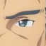
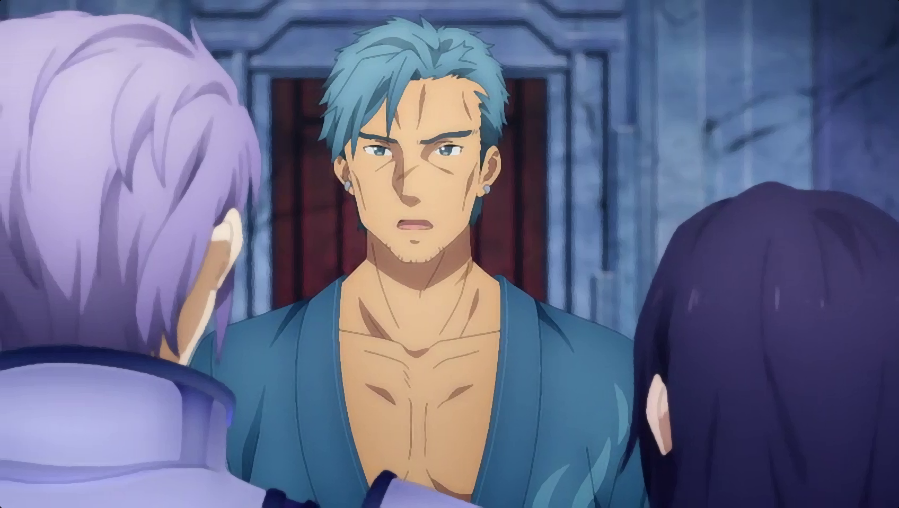

# Anime4K-rs

An attempt to write Anime4K in Rust.

> Anime4K is a state-of-the-art*, open-source, high-quality real-time anime upscaling algorithm that can be implemented in any programming language.

Anime4k repository: https://github.com/bloc97/Anime4K

## Getting Started

1. Make sure you have Rust and Cargo. If you don't have it, please install it https://rustup.rs/
2. Run `cargo build --release`
3. Run the compiled program

```
[andraantariksa@LaptopnyaAndra] anime4k-rs
Anime4K-rs 0.1
Andra Antariksa <andra.antariksa@gmail.com>
A High-Quality Real Time Upscaler for Anime Video

USAGE:
    anime4k-rs [OPTIONS] <INPUT> <OUTPUT>

FLAGS:
    -h, --help       Prints help information
    -V, --version    Prints version information

OPTIONS:
    -i, --iteration <iteration>           Sets how many the iteration to do [default: 2]
        --pcs <push-color-strength>       Sets the push color strength [default: 0]
        --pgs <push-gradient-strength>    Sets push gradient strength [default: 1]
    -s, --scale <scale>                   Sets the input file to use [default: 2]

ARGS:
    <INPUT>     Sets the input file to use
    <OUTPUT>    Sets the output file
```

## Preview

### Before




### After




## LICENSE

The project are [MIT licensed](LICENSE), except for the image.

All art assets used are for demonstration and educational purposes. All rights are reserved to their original owners. If you (as a person or a company) own the art and do not wish it to be associated with this project, please contact me at **andra.antariksa [at] gmail.com** and I will gladly take it down.
